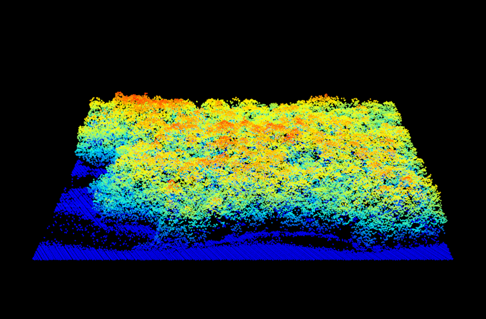
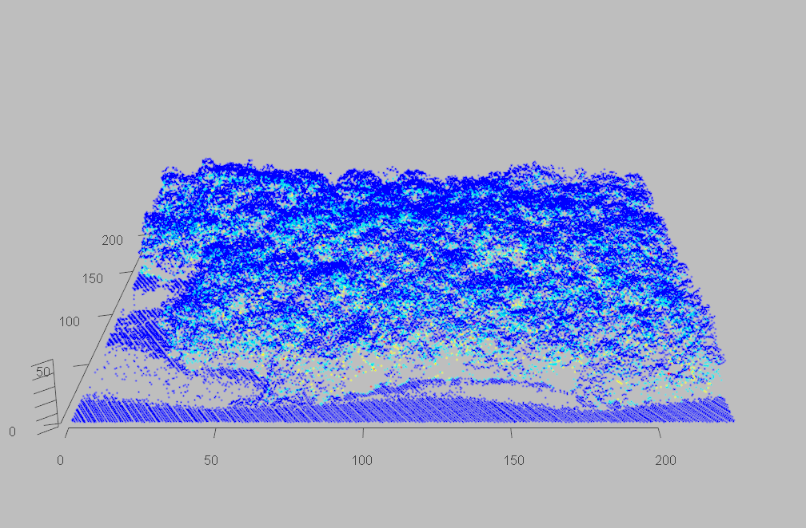

```{r vis_startup,echo=FALSE,message=FALSE,warning=FALSE}
library(lidR)
```

# Reading, Plotting, Querying, Validating {-#my-section}

## Reading and inspecting lidar data {-#my-section}

The first step to working with lidar data in R is understanding how to read a file using the `lidR`package. Here we demonstrate how to read the `Megaplot.laz` file using the `readLAS` function.

```{r}
#Read Megaplot.laz from within the lidar package
LASfile <- system.file("extdata", "Megaplot.laz", package="lidR")

#Read a .las file from a local disc
# `LAS`file <- read`LAS`("PathToYourFile.las")

#Read `LAS`file
las <- readLAS(LASfile)

#print the content summary of the las file
print(las)
```

## Plotting {-#my-section}

The `lidR` package employs a built in `PointCloudViewer`.

```{r}
#plot las object using default settings
plot(las)
```

<center>



</center>


```{r}
#plot las object by return number, make the background grey, and display XYZ axis
plot(las,color="ReturnNumber",bg="grey",axis=T)
```

<center>



</center>

## Basic structure of `LAS` objects {-#my-section}

For the purposes of this review we will briefly go over the primary contents of a `LAS` object. 

A `LAS` object is composed of four slots: 

* `@data`  - a `data.table`containing the `X,Y,Z` coordinates and attributes for all points within a file
* `@header` - a `LAS` file header that summarizes key file details
* `@proj4string` - Object that stores the coordinate reference system (`CRS`) of the las file
* `@bbox` - a matrix object that stores the `XY` bounding box of the point cloud inherited from the `Spatial` from the `sp` package

For the purposes of this section we will focus on the contents of the `@data` slot.For a thorough description of the other three `LAS` object slots see section ____. 

To query the contents of the `@data` slot we use the following code:

```{r}
# print the first 6 rows (points) of the lidar data
head(las@data)

```

This provides us with a subset of the `data.table` summarizing the `X,Y,Z` coordinates of each point, as well as other key information such as `ReturnNumber` and `Intensity`.

## Validating lidar data {-#my-section}

An important first step in lidar data processing is ensuring that your data is complete and valid. Users commonly report bugs about their point cloud being invalid. This is why we introduced the `lascheck` function to perform a deep inspection of `LAS` objects. This function checks if a `LAS` object meets specifications and whether it is invalid for processing. 

A simple example that happens fairly often is that a `LAS` file contains duplicate points. This may lead to trees being detected twice, to invalid metrics, or to errors in DTM generation, and so on… Always make sure to run the `lascheck` function before digging deep into your data.

```{r}
lascheck(las)
```

