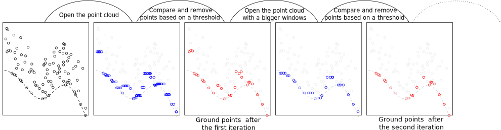
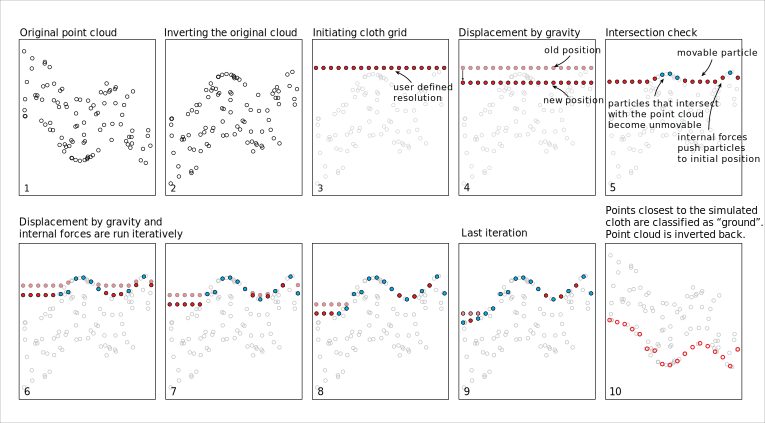

```{r,echo=FALSE,message=FALSE,warning=FALSE}
library(lidR)
library(ggplot2)
library(rgl)

source("function_plot_crossection.R")

r3dDefaults = rgl::r3dDefaults
m = structure(c(0.921, -0.146, 0.362, 0, 0.386, 0.482, -0.787, 0, 
-0.06, 0.864, 0.5, 0, 0, 0, 0, 1), .Dim = c(4L, 4L))
rgl::setupKnitr()
r3dDefaults$FOV = 50
r3dDefaults$userMatrix = m
r3dDefaults$zoom = 0.75

knitr::opts_chunk$set(
  comment =  "#>", 
  collapse = TRUE,
  fig.align = "center")
```

```{r setup, include=FALSE}
knitr::opts_chunk$set(echo = TRUE)
```

# Ground classification {#gnd}

Classification of ground points is an important step in processing point cloud data. Distinguishing between ground and non-ground points allows to create a continous model of terrain elevation (see section \@ref(dtm)). Many algorithms were reported in the litterature. `lidR` currently implements two of them: Progressive Morphological Filter (PMF) and Cloth Simulation Function (CSF) usable with the function `classify_ground()`.

## PMF

The implementation of PMF algorithm in `lidR` is based on the method described in [Zhang et al. (2003) ](https://ieeexplore.ieee.org/document/1202973) with some technical modifications. The original method is a raster-based method while `lidR` performs point-cloud-based morphological operations because `lidR` is a point-cloud oriented software. The main step of the methods are summarised in the figure below:


<center>

</center>

The `pmf()` function requires input parameters to be defined: `ws` (window size or sequence of window sizes), and `th` (threshold size or sequence of threshold heights). More experienced user may experiment with these parameters to achieve best classification accuracy, however `lidR` contains `util_makeZhangParam()` function that includes the default parameter values described in [Zhang et al. (2003) ](https://ieeexplore.ieee.org/document/1202973).

Below we present a basic example of using the `pmf()` algorithm to classify ground points. In this example we will use the `Topography.laz` dataset that is included in the `lidR` package. We start by loading the point cloud dataset:

```{r}
LASfile <- system.file("extdata", "Topography.laz", package="lidR")
las <- readLAS(LASfile, select = "xyzrn")
las_1 <- classify_ground(las, algorithm = pmf(ws = 5, th = 3))
```

We can now visualize the result:

```{r rgl=TRUE}
plot(las_1, color = "Classification", size = 3, bg = "white") 
```

To better illustrate the classification results we can generate and plot a crossection of the point cloud (see section \@ref(crossection)).

```{r, fig.height=2, fig.width=8}
p1 <- c(273420, 5274455)
p2 <- c(273570, 5274460)
plot_crossection(las_1, p1 , p2, colour_by = factor(Classification))
```


We can see that although the classification worked, there are multiple points above terrain that are classified `2` (i.e. "ground" according to [ASPRS specification](http://www.asprs.org/wp-content/uploads/2019/07/LAS_1_4_r15.pdf)). This clearly indicates that additional filtering steps are needed and that both `ws` and `th` parameters should be adjusted. Below we use multiple values for the two parameters instead of a single value in the example above.

```{r}
ws <- seq(3, 12, 3)
th <- seq(0.1, 1.5, length.out = length(ws))
las_2 <- classify_ground(las, algorithm = pmf(ws = ws, th = th))
```

After this adjustement the classification result changed, and points in the canopy are no longer classified as "ground".

```{r, fig.height=2, fig.width=8}
plot_crossection(las_2, p1 = p1, p2 = p2, colour_by = factor(Classification))
```

## CSF

Cloth simulation filtering (CSF) is based on a simulating a piece of cloth placed on top of a reversed point cloud [Zhang et al 2016](http://www.mdpi.com/2072-4292/8/6/501/htm). In this method the point cloud is turned upside down and then a  cloth is dropped on the inverted surface. Ground points are determined by analyzing the interations between the nodes of the cloth and the inverted surface. The cloth simulation itself is based on a grid that consists of particles with mass and interconnections that together determine the three-dimensional position and shape of the cloth.

<center>

</center>


The `csf()` functions use the default values proposed by [Zhang et al 2016](http://www.mdpi.com/2072-4292/8/6/501/htm) and can be used without providing any argument.

```{r}
las_3 <- classify_ground(las, algorithm = csf())
```

Similar to the previous examples classification results are assessed on a crossection:

```{r, fig.height=2, fig.width=8}
plot_crossection(las_3, p1 = p1, p2 = p2, colour_by = factor(Classification))
```

While the default parametrs of the `csf()` algorithm are designed to be universal and provide accurate classification result in majority of cases according to the original paper, it is apparent that the algorithm did not work properly in our case and a significant portion of points located in the ground were not classified. In such cases the algorithm parameters need to be tuned to improve the result. For this partricular dataset a set of parameters that resulted in an improved classification result were formulated as follows:

```{r, fig.height=2, fig.width=8}
mycsf <- csf(sloop_smooth = TRUE, class_threshold = 1, cloth_resolution = 1, time_step = 1)
las_4 <- classify_ground(las, mycsf)
plot_crossection(las_4, p1 = p1, p2 = p2, colour_by = factor(Classification))
```

```{r, rgl = TRUE}
gnd = filter_ground(las_4)
plot(gnd, size = 3, bg = "white") 
```

## Edge artifacts

No matter which algorithm is used either in `lidR` or in another software, ground classification will be weaker at the edges of the point-clouds. Indeed, to find the ground points an algorithm need to analyses the local neighborhood or local context. Context that is missing at the edges. When processing point-clouds it is important to always consider a buffer around the region of interest to avoid edge artifacts. `lidR` has tools to manage buffered tiles and this advanced use of the package will be covered in section \@ref(engine).

## How to choose a method and its parameters?

Identifying the optimal algorithm parameters is not a trivial task and often requires perfoming several test runs. `lidR` propose several algorithm and may propose even more in future versions. However the main goal is to provide a way to try and compare the algorithms. We don't know which one is better tand we don't know which parameters suit best for a given terrain. It is likely that parameters must be ajusted dynamically to the local context and thus a set of paramters that works in a given file may fail in another file.

We recommend to use the classification given by the data provider that is usually very good for we have seen so far. `classify_ground()` may be use for small to medium size unclassified region of interests. As long as it is possible to check visualy the classification those algorithm can be used safely. However for broader areas when it is no longer possible to visualy assess the accuracy we do not recommend to perform the ground classification without studing the accuracy of the classification.
