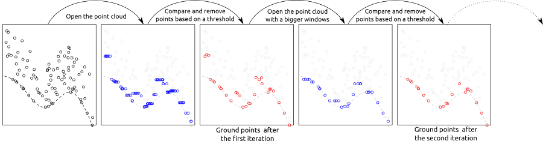

```{r setup,echo=FALSE,message=FALSE,warning=FALSE}
library(lidR)
library(ggplot2)

source("function_plot_crossection.R")

r3dDefaults = rgl::r3dDefaults
m = structure(c(0.921, -0.146, 0.362, 0, 0.386, 0.482, -0.787, 0, 
-0.06, 0.864, 0.5, 0, 0, 0, 0, 1), .Dim = c(4L, 4L))
r3dDefaults$FOV = 50
r3dDefaults$userMatrix = m
r3dDefaults$zoom = 0.75

knitr::opts_chunk$set(
  comment =  "#>", 
  collapse = TRUE,
  fig.align = "center")

rgl::setupKnitr(autoprint = TRUE)
knitr::opts_chunk$set(echo = TRUE)
```

# Ground classification {#gnd}

Classification of ground points is an important step in processing point cloud data. Distinguishing between ground and non-ground points allows creation of a continuous model of terrain elevation (see section \@ref(dtm)). Many algorithms have been reported in the literature and `lidR` currently provides three of them: Progressive Morphological Filter (PMF), Cloth Simulation Function (CSF) and Multiscale Curvature Classification (MCC) usable with the function `classify_ground()`.

## Progressive Morphological Filter {#pmf}

The implementation of PMF algorithm in `lidR` is based on the method described in [Zhang et al. (2003) ](https://ieeexplore.ieee.org/document/1202973) with some technical modifications. The original method is raster-based, while `lidR` performs point-based morphological operations because `lidR` is a point cloud oriented software. The main step of the methods are summarised in the figure below:


<center>

</center>

The `pmf()` function requires defining the following input parameters: `ws` (window size or sequence of window sizes), and `th` (threshold size or sequence of threshold heights). More experienced users may experiment with these parameters to achieve best classification accuracy, however `lidR` contains `util_makeZhangParam()` function that includes the default parameter values described in [Zhang et al. (2003) ](https://ieeexplore.ieee.org/document/1202973).

```{r, warning=FALSE}
LASfile <- system.file("extdata", "Topography.laz", package="lidR")
las <- readLAS(LASfile, select = "xyzrn")
las <- classify_ground(las, algorithm = pmf(ws = 5, th = 3))
```

We can now visualize the result:

```{r plot-gnd-classification, rgl=TRUE}
plot(las, color = "Classification", size = 3, bg = "white") 
```

To better illustrate the classification results we can generate and plot a cross section of the point cloud (see section \@ref(plot-crossection)).

```{r plot-gnd-crossection, fig.height=2, fig.width=8}
p1 <- c(273420, 5274455)
p2 <- c(273570, 5274460)
plot_crossection(las, p1 , p2, colour_by = factor(Classification))
```

We can see that although the classification worked, there are multiple points above terrain that are classified `2` (i.e. "ground" according to [ASPRS specifications](http://www.asprs.org/wp-content/uploads/2019/07/LAS_1_4_r15.pdf)). This clearly indicates that additional filtering steps are needed and that both `ws` and `th` parameters should be adjusted. Below we use multiple values for the two parameters instead of a single value in the example above.

```{r, message = FALSE}
ws <- seq(3, 12, 3)
th <- seq(0.1, 1.5, length.out = length(ws))
las <- classify_ground(las, algorithm = pmf(ws = ws, th = th))
```

After this adjustment the classification result changed, and points in the canopy are no longer classified as "ground".

```{r plot-gnd-crossection-2, fig.height=2, fig.width=8}
plot_crossection(las, p1 = p1, p2 = p2, colour_by = factor(Classification))
```

## Cloth Simulation Function {#csf}

Cloth simulation filtering (CSF) uses the [Zhang et al 2016](http://www.mdpi.com/2072-4292/8/6/501/htm) algorithm and consists of simulating a piece of cloth draped over a reversed point cloud. In this method the point cloud is turned upside down and then a  cloth is dropped on the inverted surface. Ground points are determined by analyzing the interactions between the nodes of the cloth and the inverted surface. The cloth simulation itself is based on a grid that consists of particles with mass and interconnections that together determine the three-dimensional position and shape of the cloth.

<center>

</center>

The `csf()` functions use the default values proposed by [Zhang et al 2016](http://www.mdpi.com/2072-4292/8/6/501/htm) and can be used without providing any arguments.

```{r, message = FALSE}
las <- classify_ground(las, algorithm = csf())
```

Similar to the previous examples, classification results can be assessed using a cross section:

```{r plot-gnd-crossection-3, fig.height=2, fig.width=8}
plot_crossection(las, p1 = p1, p2 = p2, colour_by = factor(Classification))
```

While the default parameters of `csf()` are designed to be universal and provide accurate classification results, according to the original paper, it's apparent that the algorithm did not work properly in our example because a significant portion of points located in the ground were not classified. In such cases the algorithm parameters need to be tuned to improve the result. For this particular data set a set of parameters that resulted in an improved classification result were formulated as follows:

```{r plot-gnd-crossection-4, fig.height=2, fig.width=8, message=FALSE}
mycsf <- csf(sloop_smooth = TRUE, class_threshold = 1, cloth_resolution = 1, time_step = 1)
las <- classify_ground(las, mycsf)
plot_crossection(las, p1 = p1, p2 = p2, colour_by = factor(Classification))
```

We can also subset only the ground points to display the results in 3D

```{r plot-gnd, rgl = TRUE}
gnd <- filter_ground(las)
plot(gnd, size = 3, bg = "white") 
```

## Multiscale Curvature Classification (MCC) {#mcc}

Multiscale Curvature Classification (MCC) uses the [Evans and Hudak 2016](https://ieeexplore.ieee.org/document/4137852) algorithm originally implemented in the [mcc-lidar](https://sourceforge.net/projects/mcclidar/) software.

```{r, echo=FALSE}
las$Classification <- 0L
```

```{r plot-gnd-crossection-5, fig.height=2, fig.width=8}
las <- classify_ground(las, mcc(1.5,0.3))
plot_crossection(las, p1 = p1, p2 = p2, colour_by = factor(Classification))
```

## Edge artifacts {#edge-artifact}

No matter which algorithm is used in `lidR` or other software, ground classification will be weaker at the edges of point clouds as the algorithm must analyze the local neighbourhood (which is missing on edges). To find ground points, an algorithm need to analyze the local neighborhood or local context that is missing at edge areas. When processing point clouds it's important to always consider a buffer around the region of interest to avoid edge artifacts. `lidR` has tools to manage buffered tiles and this advanced use of the package will be covered in section \@ref(engine).

## How to choose a method and its parameters? {#method-selection}

Identifying the optimal algorithm parameters is not a trivial task and often requires several trial runs. `lidR` proposes several algorithms, and may propose even more in future versions, however the main goal is to provide a mean to compare outputs. We don't know which one is better, and we don't know which parameters best suit a given terrain. It's likely that parameters need to be dynamically adjusted to the local context, providing reasoning for why parameters works in one file may provide inadequate results in another.

If available, we recommend using classifications given by the data provider. `classify_ground()`is useful for small to medium size unclassified region of interests because it is feasible to visually assess classification results. For large acquisitions where visual assessment is no longer feasible, we do not recommend performing ground classification without studying its accuracy ahead of time.

## Other methods {#other}

Ground segmentation is not limited to the 3 methods described above. Many more have been presented and described in the literature. In section \@ref(plugins) we will learn how to create a plugin algorithm and test it seamlessly in R with `lidR` using a syntax like:

```r
las <- classify_ground(las, algorithm = my_new_method(param1 = 0.05))
```
