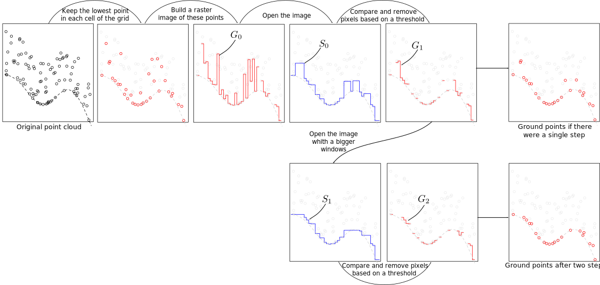

```{r,echo=FALSE,message=FALSE,warning=FALSE}
library(lidR)
library(ggplot2)
library(rgl)

r3dDefaults = rgl::r3dDefaults
m = structure(c(0.921, -0.146, 0.362, 0, 0.386, 0.482, -0.787, 0, 
-0.06, 0.864, 0.5, 0, 0, 0, 0, 1), .Dim = c(4L, 4L))
rgl::setupKnitr()
r3dDefaults$FOV = 50
r3dDefaults$userMatrix = m
r3dDefaults$zoom = 0.75
```

```{r setup, include=FALSE}
knitr::opts_chunk$set(echo = TRUE)
```

# Ground classification

Classification of ground points is an important step in processing point cloud data. Distinguishing between ground and non-ground points allows to not only create a continous model of terrain elevation (or Digital Terrain Model, DTM), but is also crucial for some of the following processing steps. 

Two ground classification algorithms are currently implemented in `lidR`: Progressive Morphological Filter (`pmf()`) and Cloth Simulation Function (`csf()`). 


## PMF

The implementation of PMF algorithm in `lidR` is based on the method described in [Zhang et al. (2003) ](https://ieeexplore.ieee.org/document/1202973). In this approach an initial raster surface is created based on the lowest point within each pixel. Morphological opening is then performed using a user defined window size. The resulting raster surface is compared with the initial one and all differences that exceed user-defined threshold value are removed. The operation is then repeated several times, resulting in further filtering of the initial raster surface. The remaining pixels represent lowest points and are used to classify them as "ground".


<center>



</center>

The `pmf()` function requires to input parameters to be defined: `ws` (window size or sequence of window sizes), and `th` (threshold size or sequence of threshold heights). More experienced user may experiment with these parameters to achieve best classification accuracy, however `lidR` contains `util_makeZhangParam()` function that includes the default paramter values described in [Zhang et al. (2003) ](https://ieeexplore.ieee.org/document/1202973).

Below we present a basic example of using the `pmf()` algorithm to classify ground points. In this example we will use the `Topography.laz` dataset that is included in the `lidR` package. We start by loading the point cloud dataset:

```{r}
LASfile <- system.file("extdata", "Topography.laz", package="lidR")
las <- readLAS(LASfile, select = "xyzrn")

```

We then use the `lasground()` function to generated a DTM. In the first run we will run the function with a single window size and single threshold value.
```{r}
las_1 <- lasground(las, algorithm = pmf(ws = 5, th = 3))
```

We can now visualize the result:

```{r rgl=TRUE}
plot(las_1, color = "Classification") 
```

To better illustrate the classification results we can generate and plot a crossection of the point cloud. In this case the crossection will be 150 m long (X from `273570` to `273420`), oriented along the X axis, and 2 m wide. To do this we will use the `lasclipTransect()` function as follows:

```{r}
tr_las_1 <- clip_transect(las_1, 
                          p1 = c(273420, 5274455), 
                          p2 = c(273570, 5274460), width = 2)
```

To visualize the crossection we plot the `Z` coordinate on the y-axis.
```{r}
ggplot(tr_las_1@data, aes(X,Z, color=factor(Classification))) + 
  geom_point() + 
  coord_equal() + 
  theme_bw() +
  theme(legend.position = "bottom")
  # theme(plot.margin = unit(c(-5,1,0,-5), "cm")) #this can be used as a workaround to remove the whitespace above and below the plot. Still looking for a better solution.
```

We can see that although the classification worked, there are multiple points above terrain that are classified as "2" ("ground"). This clearly indicates that additional filtering steps are needed and that both `ws` and `th` parameters should be adjusted. Below we use multiple values for the two parameters instead of a single value in the example above.

```{r}
ws <- seq(3, 12, 3)
th <- seq(0.1, 1.5, length.out = length(ws))

las_2 <- lasground(las, algorithm = pmf(ws = ws, th = th))
```


The crossection plot is useful to investigate the result of any point classification or any other point cloud processing result. Because we will use it often in this chapter we will create a simple function that will combine the point cloud cliping and plotting. In this function we will use the same previously used point coordinates as beggining and end of the crossection as the default values.


```{r}
plot_crossection <- function(data, 
                             p1 = c(273420, 5274455), 
                             p2 = c(273570, 5274460),
                             width = 2) {
  
  #clip pointcloud using the provided coordinates
  data_clip <- clip_transect(data, 
                          p1 = p1, 
                          p2 = p2, 
                          width = width)
  
  #generate the plot
  p <- ggplot(data_clip@data, aes(X,Z, color=factor(Classification))) + 
    geom_point() + 
    coord_equal() + 
    theme_bw() +
    theme(legend.position = "none")
  
  return(p)
}
```


After this adjustement the classification result changed, and points in the canopy are no longer classified as "ground".
```{r}
plot_crossection(las_2)
```


## CSF


Cloth simulation filtering (CSF) is based on a simulating a piece of cloth placed on top of a reversed point cloud [Zhang et al 2016](http://www.mdpi.com/2072-4292/8/6/501/htm). In this method the point cloud is turned upside down and then a  cloth is dropped on the inverted surface. Ground points are determined by analyzing the interations between the nodes of the cloth and the inverted surface. The cloth simulation itself is based on a grid that consists of particles with mass and interconnections that together determine the three-dimensional position and shape of the cloth.

<center>


</center>


The `csf()` algorithm works in several steps. After the point cloud is inverted, an intitial cloth grid is generated and set above the highest point and displacement of each particle is calculated under the influence of gravity. Particles that were moved under the point cloud are moved on the ground and set as unmovable. The movable particles are processed futher and moved according to forces produced by neighbour particles.

`csf()` requires all of the above parameters to be defined with the default values proposed by [Zhang et al 2016](http://www.mdpi.com/2072-4292/8/6/501/htm). The algorithm can be therefore run with the default settings as follows:

```{r}
las_3 <- lasground(las, csf())
```

Similar to the previous examples classification results are assessed on a crossection:

```{r}
plot_crossection(las_3)
```


While the default parametrs of the `csf()` algorithm are designed to be universal and provide accurate classification result in majority of cases, it is apparent that the algorithm did not work properly in our case and a significant portion of points located in the ground is not classified. In such cases the algorithm parameters need to be tuned to improve the result. 

The algorithm parameters include: `cloth_resolution` that defines the distance between particles in the cloth; `time_step`, which determines the displacement of the particles under gravity; `rigidness`, which determines how rigid the cloth is; and `slope_smooth` parameter that indicates whether the additional post-processing step for steep slopes should be performed. Users can also define the distance to the simulated cloth to classify a point as ground (`class_threshold`) and the number of `iterations` the method is run.

Identifying the optimal algorithm parameters is not a trivial task and often requires perfoming several test runs. For this partricular dataset a set of parameters that resulted in an improved classification result were formulated as follows:
```{r}
mycsf <- csf(sloop_smooth = TRUE, # @JR I think it is best to rename this to "slope_smooth"
             class_threshold = 1, 
             cloth_resolution = 1,
             time_step = 1) # @JR - in the manual you write that this rarerly should be modified, yet in my tests this showed to be the most important parameter. I think it is best to remove this sentence in the manual: "Usually, there is no need to change this value. It is suitable for most cases."
```


Ground classification can be then performed again with the modified parameters.

```{r}
las_4 <- lasground(las, mycsf)

plot_crossection(las_4)

```
