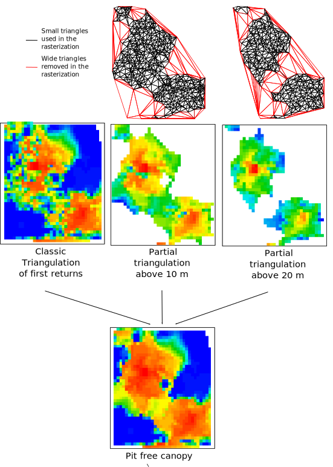

```{r,echo=FALSE,message=FALSE,warning=FALSE}
r3dDefaults = rgl::r3dDefaults
m = structure(c(0.921, -0.146, 0.362, 0, 0.386, 0.482, -0.787, 0, 
-0.06, 0.864, 0.5, 0, 0, 0, 0, 1), .Dim = c(4L, 4L))
rgl::setupKnitr()
r3dDefaults$FOV = 40
r3dDefaults$userMatrix = m
r3dDefaults$zoom = 0.75
library(lidR)
library(ggplot2)
library(forcats)

source("function_plot_crossection.R")

knitr::opts_chunk$set(
  comment =  "#>", 
  collapse = TRUE,
  fig.align = "center")
```

# Digital Surface Model and Canopy Height model

Digital Surface Model (DSM) and Canopy Height Model (CHM) are raster layers that represent, more or less the highest elevation of lidar returns. In case of a normalized point-cloud with relative elevations the derived surface represents the canopy height (for vegetated areas) and is refered to as CHM. When the original point-cloud with absolute elevations is used, the derived layer represents the elevation of the top of the canopy above sea level, and is refered to as DSM. Both surface models are derived using the same algorithms, with the only difference being the elevation values of the point cloud.

Different methods exist to create DSM and CHM. In the most simple case, a grid can be created with user-defined pixel size and elevation of the highest point can be assigned to in each grid cell. It is called point-to-raster. But more complex methods were suggested in the litterature. In this section we will use the `MixedConifer` dataset from the package that is already normalized.

```{r, rgl = TRUE}
LASfile <- system.file("extdata", "MixedConifer.laz", package ="lidR")
las <- readLAS(LASfile)
plot(las, size = 3,bg = "white")
```

## Point-to-raster

Point-to-raster algorithm is conceptually simple, consisting of establishing a grid at a user defined resolution and attributing the elevation of the highest point to each pixel. Algorithmic implementations are computationally simple and extremely fast. In the first example we will set the pixel size to `1` and use `p2r()` algorithm.


```{r, fig.height=5.9, fig.width=6}
chm <- grid_canopy(las, res = 1, algorithm = p2r())
col <- height.colors(50)
plot(chm, col = col)
```

One drawback of the point-to-raster method is that some pixels can be empty if the grid resolution is too fine for the available point density. Some pixels may then fall within a location that does not contain any points, and as a result the value is not defined. In the second example we will use the exact same method, but increase the level of detail by changing the pixel size to 0.5 m:

```{r, fig.height=5.9, fig.width=6}
chm <- grid_canopy(las, res = 0.5, algorithm = p2r())
plot(chm, col = col)
```
We can clearly see that there are a lot of empty pixels in the derived surface that correspond to No data areas in the point cloud. The level of detail was increased, however the CHM contains to many voids. 

One option to reduce the number of voids in the surface model is to replace every point in the point cloud with a disk of a know radius (e.g. 15 cm). This opertaion is meant to simulate the fact that the laser footprint is not a point, but rather a circular area. It is equivalent to compute the CHM on a point cloud that is more dense and smooths the CHM in such a way that is not reproducible in post-processing and that has a physical meaning. 

```{r, fig.height=5.9, fig.width=6}
chm <- grid_canopy(las, res = 0.5, algorithm = p2r(subcircle = 0.15))
plot(chm, col = col)
```

This CHM is the CHM computed "as if" the point cloud was the following

```{r, rgl = TRUE, echo = FALSE, fig.height=5.9, fig.width=6}
data = lidR:::subcircled(las@data, r = 0.15, 8)
las2 = suppressWarnings(LAS(data, las@header))
plot(las2, size = 3, bg = "white")
```

We can zoom in to see the small disks that replace each point

```{r, rgl = TRUE, echo = FALSE}
r3dDefaults = rgl::r3dDefaults
m2 = structure(c(0.852, -0.496, 
    -0.162, 0, 0.472, 0.865, 
    -0.165, 0, 0.222, 0.064, 
    0.972, 0, 0, 0, 0, 1), .Dim = c(4L, 4L))
r3dDefaults$FOV = 30
r3dDefaults$userMatrix = m2
r3dDefaults$zoom = 0.1
plot(las2, size = 5, bg = "white")
r3dDefaults$FOV = 40
r3dDefaults$userMatrix = m
r3dDefaults$zoom = 0.75
```

The `p2r()` function contains one additional argument that allows to interpolate the remaining empty pixels. Empty pixels are interpolated uaing spatial interpolation methods seen in chapter \@ref(dtm).

```{r, warning=F, message=F, fig.height=5.9, fig.width=6}
chm <- grid_canopy(las, res = 0.5, p2r(0.2, na.fill = tin()))
plot(chm, col = col)
```

## Triangulation

Triangulation algorithm works by first creating a triangular irregular network using first returns only, followed by interpolation within each triangle to compute an elevation value for each pixel of a raster. In its simplest form, this method consists of a strict 2-D triangulation of first returns. Despite being more complex compared to the point-to-raster algorithm, an advantage of the triangulation approach is that it is parameter free and it does not output empty pixels, regardless of the resolution of the output raster (i.e. the entire area is interpolated). 

However, like the point-to-raster method, it can lead to gaps and other noise in the surface so-called “pits” attributable to first returns that penetrated deep into the canopy.Pits can make individual tree segmentation more difficult and change the texture of the canopy in a non realistic way. To avoid this issue the CHM is often smoothed, in post processing in an attempt to produce a more realistic surface with fewer pits and less noise. To create a surface model using triangulation we use the `dsmtin()` algorithm.


```{r, fig.height=5.9, fig.width=6}
chm <- grid_canopy(las, res = 0.5, dsmtin())
plot(chm, col = col)
```

Also the triangulation method may be weak when a lot of points are missing. We can generate an example using the `Topography.laz` dataset that contains empty lakes.

 ```{r, rgl = TRUE}
LASfile <- system.file("extdata", "Topography.laz", package = "lidR")
las2 <- readLAS(LASfile)
las2 = normalize_elevation(las2, tin())
plot(las2, size = 3, bg = "white")
```

In this case the CHM is incorrectly computed in the empty lakes

```{r, fig.height=5.9, fig.width=6}
chm <- grid_canopy(las2, res = 0.5, dsmtin())
plot(chm, col = col)
```

To fix that an option is to use the argument `max_edge` which defines the maximum edge of a triangle in the Delaunay triangulation. By default this argument is set to `0` meaning that no triangles are removed. If set to e.g. 8 it means that every triangule with an edge longer than 8 will be discarded from the triangulation.
 
 ```{r, fig.height=5.9, fig.width=6}
chm <- grid_canopy(las2, res = 0.5, dsmtin(max_edge = 8))
plot(chm, col = col)
```

## Pit-free algorithm

More advanced algorithms have also been designed that avoid pits during the computation step instead of requiring a post-processing. [Khosravipour et al. (2014)](https://www.ingentaconnect.com/content/asprs/pers/2014/00000080/00000009/art00003?crawler=true) proposed a ‘pit-free’ algorithm, which consists of a series of Delaunay triangulations on first return made sequentially using points higher than thresholds. For each threshold, the triangulation  is cleaned of triangles that are too wide similarly to the example given in the previous section. In a final step, the partial rasters are stacked and only the highest pixels of each raster are retained (figure below). The output is a DSM that is expected to be natively free of pits without using any post-processing or correction methods. 

<center>


</center>

To well understand the method we can reproduce the figure above with `dsmtin()`:

```{r, fig.height=6.6, fig.width=7.4}
# The first layer is a regular triangulation
layer0 = grid_canopy(las, res = 0.5, dsmtin())

# Trianglation of first return above 10 m
above10 <- filter_poi(las, Z >= 10)
layer10 <- grid_canopy(above10, res = 0.5, dsmtin(max_edge = 1.5))

# Trianglation of first return above 20 m
above20 <- filter_poi(above10, Z >= 20)
layer20 <- grid_canopy(above20, res = 0.5, dsmtin(max_edge = 1.5))

# The final surface is the stack or the partial rasters
dsm <- layer0
dsm[] <- pmax(layer0[], layer10[], layer20[], na.rm = T)

layers  <- raster::stack(layer0, layer10, layer20, dsm)
names(layers) <- c("Base", "Layer10m", "Layer20m", "pitfree")
plot(layers, col = col)
```

In practice the internal implementation of `pitfree()` works pretty much like the example above but is easiest to use.

```{r, fig.height=5.9, fig.width=6}
chm <- grid_canopy(las, res = 0.5, pitfree(thresholds = c(0, 10, 20), max_edge = c(0, 1.5)))
plot(chm, col = col)
```

By increasing the `max_edge` argument for the pit-free triangulation part from `1.5` to `2` the produced CHM becomes smoother:

```{r, fig.height=5.9, fig.width=6}
chm <- grid_canopy(las, res = 0.5, pitfree(max_edge = c(0, 2)))
plot(chm, col = col)
```

Similarly to point-to-raster, the pit-free algorithm in lidR also includes a `subcircle` option that replace each first return by a disk made of 8 points. Because it would be too computationnaly demanding to triangulate 8 times more point the choice has been made to select only the highest point of each pixel after subcircling to perform the triangulation.


```{r, fig.height=5.9, fig.width=6}
chm <- grid_canopy(las, res = 0.5, pitfree(subcircle = 0.15))
plot(chm, col = col)
```

## Post-processing a CHM

Usually, in the litterature, CHMs are post-processed to smooth then or to fill empty pixels. This is mainly because most of the papers use a point-to-raster approach whithout any tweak. With a pit-free method or the subcircle tweak it is less useful. Anyway, one may want to apply a post-processing step to the CHM. Sadly `lidR` does not provide any tools for that. `lidR` is a point-cloud oritneted software. Once an function returned a raster, the job of the `lidR` package is ended. Futher work requires other tools dedicated to process raster. The `raster` package is one of those. The code below present a simple option to fill NAs and smooth a CHM with the `raster` package. For more details see the documentation of the package `raster`.

```{r, fig.height=6.6, fig.width=7.4}
fill.na <- function(x, i=5) { if (is.na(x)[i]) { return(mean(x, na.rm = TRUE)) } else { return(x[i]) }}
w = matrix(1, 3, 3)

chm <- grid_canopy(las, res = 0.5, algorithm = p2r(subcircle = 0.15))
filled = focal(chm, w, fun = fill.na)
smoothed = focal(chm, w, fun = mean, na.rm = TRUE)

chms = stack(chm, filled, smoothed)
names(chms) <- c("Base", "Filled", "Smoothed")
plot(chms, col = col)
```


