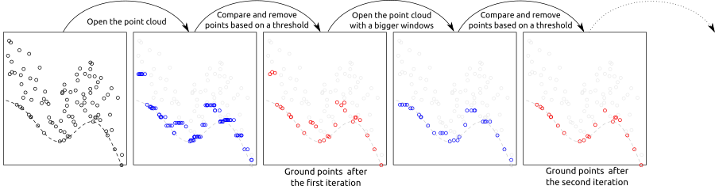
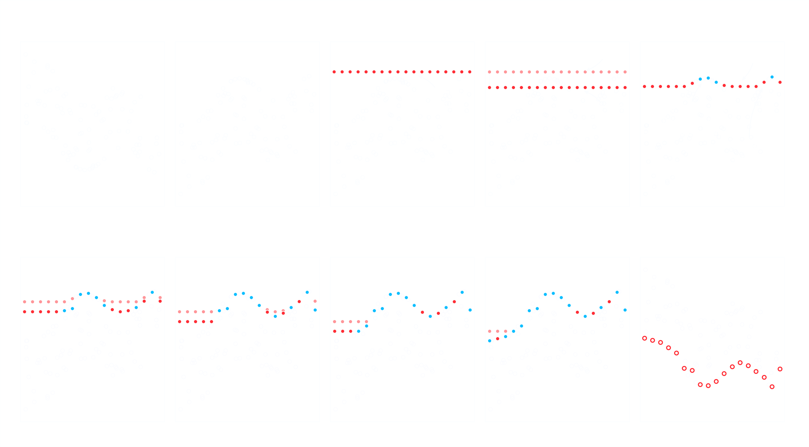
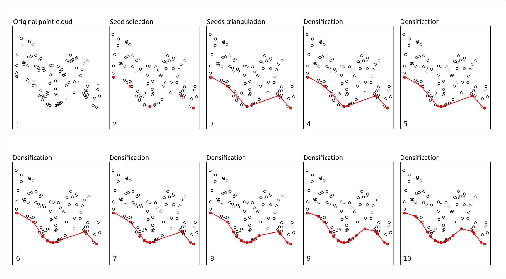
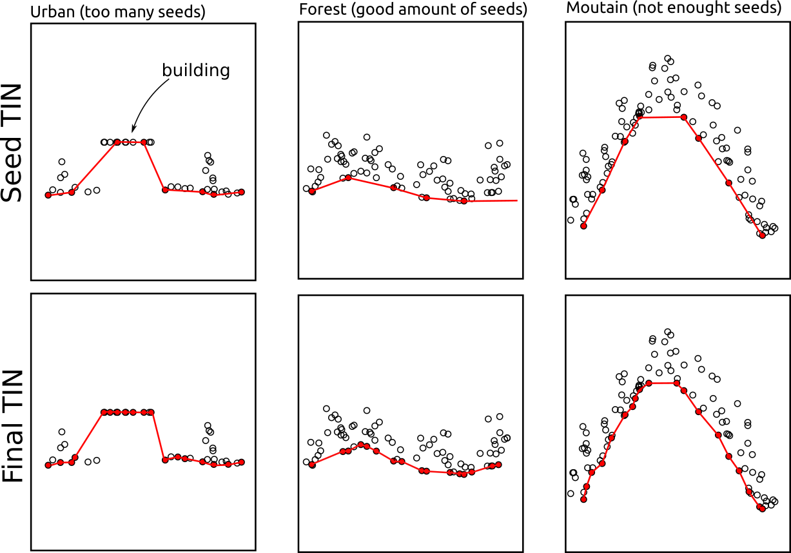
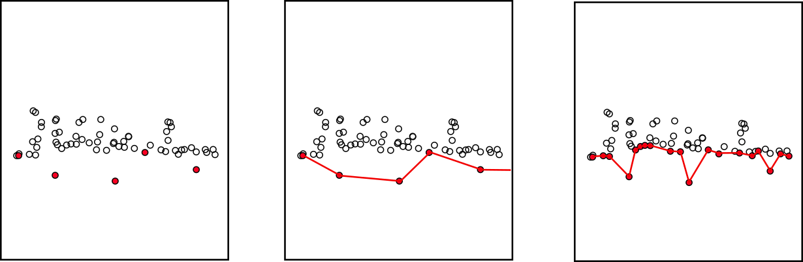
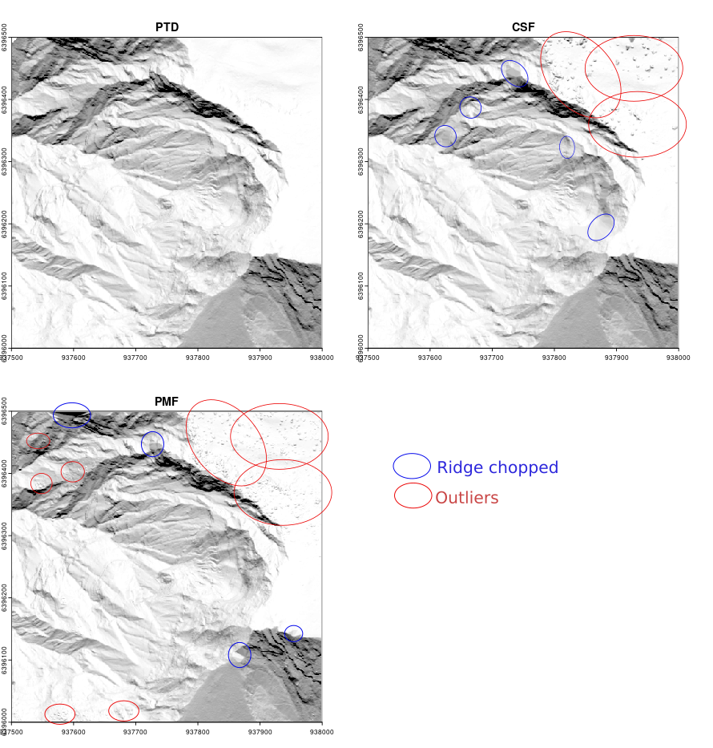
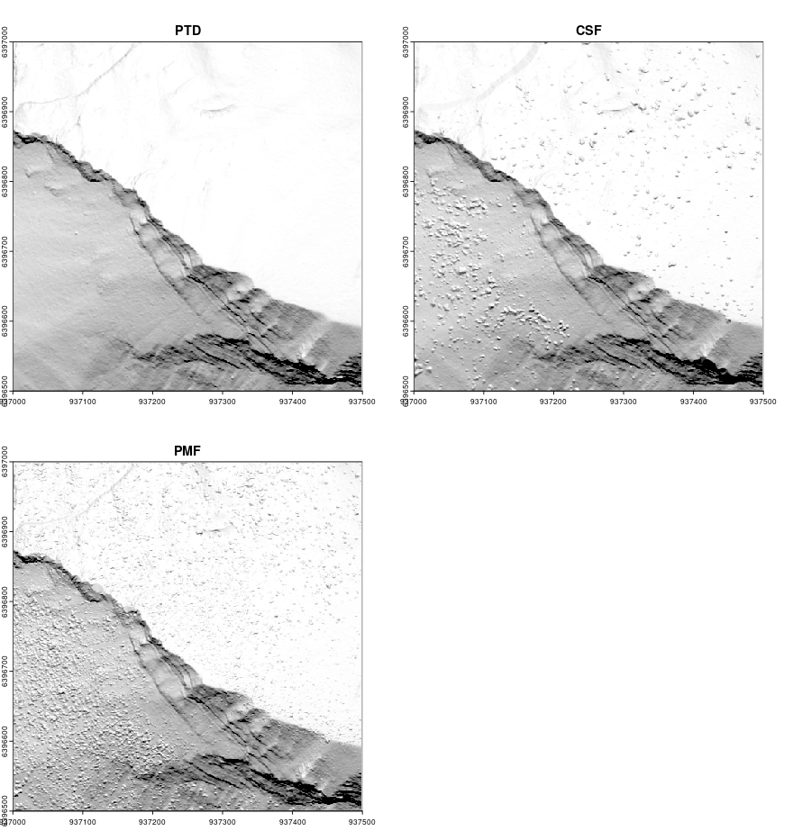

```{r setup,echo=FALSE,message=FALSE,warning=FALSE}
library(lidR)
library(ggplot2)

source("function_plot_crossection.R")

r3dDefaults = rgl::r3dDefaults
m = structure(c(0.921, -0.146, 0.362, 0, 0.386, 0.482, -0.787, 0, 
-0.06, 0.864, 0.5, 0, 0, 0, 0, 1), .Dim = c(4L, 4L))
r3dDefaults$FOV = 50
r3dDefaults$userMatrix = m
r3dDefaults$zoom = 0.75

knitr::opts_chunk$set(
  comment =  "#>", 
  collapse = TRUE,
  fig.align = "center")

rgl::setupKnitr(autoprint = TRUE)
knitr::opts_chunk$set(echo = TRUE)
```

# Ground Classification {#sec-gnd}

Classification of ground points is an important step in processing point cloud data. Distinguishing between ground and non-ground points allows creation of a continuous model of terrain elevation (see @sec-dtm)). Many algorithms have been reported in the literature and `lidR` currently provides four of them: Progressive Morphological Filter (PMF), Cloth Simulation Function (CSF), Multiscale Curvature Classification (MCC) and Progressive TIN densification (PTD) usable with the function `classify_ground()`.

::: callout-tip
## Progressive TIN densification

In January 2026, we added Progressive TIN Densification (PTD) to lidR 4.3.0. We strongly recommend using this algorithm exclusively, as it outperforms all others. For legacy reasons, the algorithms described in Sections @sec-pmf, @sec-csf, and @sec-mcc are still included in the book and are maintained as is, but new readers can move on @sec-ptd.
:::

## Progressive Morphological Filter {#sec-pmf}

The implementation of PMF algorithm in `lidR` is based on the method described in [Zhang et al. (2003)](https://ieeexplore.ieee.org/document/1202973) with some technical modifications. The original method is raster-based, while `lidR` performs point-based morphological operations because `lidR` is a point cloud oriented software. The main step of the methods are summarised in the figure below:

<center></center>

The `pmf()` function requires defining the following input parameters: `ws` (window size or sequence of window sizes), and `th` (threshold size or sequence of threshold heights). More experienced users may experiment with these parameters to achieve best classification accuracy, however `lidR` contains `util_makeZhangParam()` function that includes the default parameter values described in [Zhang et al. (2003)](https://ieeexplore.ieee.org/document/1202973).

```{r, warning=FALSE}
LASfile <- system.file("extdata", "Topography.laz", package="lidR")
las <- readLAS(LASfile, select = "xyzrn")
las <- classify_ground(las, algorithm = pmf(ws = 5, th = 3))
```

We can now visualize the result:

```{r plot-gnd-classification, rgl=TRUE}
plot(las, color = "Classification", size = 3, bg = "white") 
```

To better illustrate the classification results we can generate and plot a cross section of the point cloud (see @sec-plot-crossection)).

```{r plot-gnd-crossection, echo=FALSE, fig.height=2, fig.width=8}
p1 <- c(273420, 5274455)
p2 <- c(273570, 5274460)
plot_crossection(las, p1 , p2, colour_by = factor(Classification))
```

We can see that although the classification worked, there are multiple points above terrain that are classified `2` (i.e. "ground" according to [ASPRS specifications](http://www.asprs.org/wp-content/uploads/2019/07/LAS_1_4_r15.pdf)). This clearly indicates that additional filtering steps are needed and that both `ws` and `th` parameters should be adjusted. Below we use multiple values for the two parameters instead of a single value in the example above.

```{r, message = FALSE}
ws <- seq(3, 12, 3)
th <- seq(0.1, 1.5, length.out = length(ws))
las <- classify_ground(las, algorithm = pmf(ws = ws, th = th))
```

After this adjustment the classification result changed, and points in the canopy are no longer classified as "ground".

```{r plot-gnd-crossection-2, echo=FALSE, fig.height=2, fig.width=8}
plot_crossection(las, p1 = p1, p2 = p2, colour_by = factor(Classification))
```

## Cloth Simulation Function {#sec-csf}

Cloth simulation filtering (CSF) uses the [Zhang et al 2016](http://www.mdpi.com/2072-4292/8/6/501/htm) algorithm and consists of simulating a piece of cloth draped over a reversed point cloud. In this method the point cloud is turned upside down and then a cloth is dropped on the inverted surface. Ground points are determined by analyzing the interactions between the nodes of the cloth and the inverted surface. The cloth simulation itself is based on a grid that consists of particles with mass and interconnections that together determine the three-dimensional position and shape of the cloth.

<center></center>

The `csf()` functions use the default values proposed by [Zhang et al 2016](http://www.mdpi.com/2072-4292/8/6/501/htm) and can be used without providing any arguments.

```{r, message = FALSE}
las <- classify_ground(las, algorithm = csf())
```

Similar to the previous examples, classification results can be assessed using a cross section:

```{r plot-gnd-crossection-3, echo=FALSE, fig.height=2, fig.width=8}
plot_crossection(las, p1 = p1, p2 = p2, colour_by = factor(Classification))
```

While the default parameters of `csf()` are designed to be universal and provide accurate classification results, according to the original paper, it's apparent that the algorithm did not work properly in our example because a significant portion of points located in the ground were not classified. In such cases the algorithm parameters need to be tuned to improve the result. For this particular data set a set of parameters that resulted in an improved classification result were formulated as follows:

```{r plot-gnd-crossection-4, message=FALSE}
mycsf <- csf(sloop_smooth = TRUE, class_threshold = 1, cloth_resolution = 1, time_step = 1)
las <- classify_ground(las, mycsf)
```

```{r, echo=FALSE, fig.height=2, fig.width=8}
plot_crossection(las, p1 = p1, p2 = p2, colour_by = factor(Classification))
```

We can also subset only the ground points to display the results in 3D

```{r plot-gnd, rgl = TRUE}
gnd <- filter_ground(las)
plot(gnd, size = 3, bg = "white") 
```

## Multiscale Curvature Classification {#sec-mcc}

Multiscale Curvature Classification (MCC) uses the [Evans and Hudak 2016](https://ieeexplore.ieee.org/document/4137852) algorithm originally implemented in the [mcc-lidar](https://sourceforge.net/projects/mcclidar/) software.

```{r, echo=FALSE}
las$Classification <- 0L
```

```{r plot-gnd-crossection-5}
las <- classify_ground(las, mcc(1.5,0.3))
```

```{r, echo=FALSE, fig.height=2, fig.width=8}
plot_crossection(las, p1 = p1, p2 = p2, colour_by = factor(Classification))
```

## Progressive TIN Densification {#sec-ptd}

Progressive TIN Densification (PTD) was proposed by [Axelsson (2000)](https://www.isprs.org/proceedings/xxxiii/congress/part4/111_xxxiii-part4.pdf). It the most widely used algorithms in industry and in closed-source software such as LAStools or TerraScan (with potentially undocumented variations). It generally outperforms PMF, CSF, and MCC, especially in complex terrain such as mountains.

::: callout-tip
In early 2026, we added PTD to lidR and we now recommend using it exclusively.
:::

PTD starts with a small set of points that are very likely to be on the ground (called *seeds*), usually the lowest points in the area, and uses them to create an initial Triangulated Irregular Network (TIN). Then, other points are tested one by one and added to the TIN if they fit the shape of the current surface, based on simple rules such as maximum slope or height difference with the current TIN. Points that are too high or that create sharp angles are rejected as non-ground objects (trees, buildings, etc.). By progressively adding only compatible points, the TIN gradually adapts to the true terrain, producing a reliable ground model even in complex landscapes.

<center></center>

Unlike PMF, CSF, or RMCC, which classify all ground points based on a buffer above a reference surface (e.g. +10 cm) and therefore classify ground points without spacing limits, PTD can stop the densification when triangles become too small. This effectively introduces a maximum spacing between ground points, avoiding useless (and even harmful for computational purposes) over-densification of ground points.


```r
las <- classify_ground(las, ptd(20))
```

### PTD seeds

PTD starts by selecting seeds. A seed is the lowest point found within each cell of a grid with resolution `res`. This parameter is very important because all seeds must be actual ground points. If some seeds are not ground points, the final classification will be incorrect (some low noise points are tolerated; see later). The resolution must be chosen large enough so that the lowest point in each cell is actually a ground point and not, for example, a rooftop or a tree (see figure below). At the same time, we want to have as many seeds as possible to capture steep variations in the terrain. If the seeds are too widely spaced, PTD may miss and truncate some mountain tops (see figure below).

<center>{width=450}</center><br/>

In urban environments, we recommend using `res = 50` or larger to ensure that rooftops are not captured as seeds. In forested environments with *standard* condition, we recommend `res = 20`. In steep mountainous terrain, we recommend `res = 10`. In some cases, depending on the acquisition settings and forest cover, the point cloud may contain very few ground points. In this case, `res` must be increased to avoid capturing non-ground points.

### PTD densification

The densification is governed by two criteria. For each triangle, a new point is inserted into the triangulation if the angle is below a threshold (parameter `angle`) and if its distance is below a threshold (parameter `distance`). The default settings work well in most standard contexts. For the definition of angle and distance the reader can refer to the PTD publication linked above.

Changing `distance` and `angle` is, however, mandatory in very steep mountainous areas, where PTD must tolerate strong local variations and therefore be less conservative. In mountainous terrain, we recommend using `angle = 40` and `distance = 3`.

In very flat terrain, in order to reduce the risk of misclassification, users can make PTD more conservative with, for example, `angle = 10` and `distance = 1`.

### Low outliers

In the original PTD, low outliers are, by construction, a serious issue. Low outliers are almost systematically the lowest points of each grid cell but are not ground points. Consequently, at the end of the densification, even in the best case, the ground classification contains outliers that will generate spikes in the DTM.

<center>{width=450}</center><br/>

The best way to avoid this problem is, of course, to feed PTD with a clean point cloud from which outliers have already been removed upstream. However, lidR's PTD is equipped with and enhanced by an internal outlier removal system that detects and cleans ground outliers. This procedure is robust and has produced very satisfactory results on all datasets tested.

### Comparisons

See @sec-dtm to learn how to build a DTM. Below are the results of the best ground classifications and DTMs we were able to achieve with CSF, PMF, and PTD in a complex mountainous scene with sharp ridges and steep slopes. Although the images are rendered small in this book, we can observe that ridges and slopes are better classified with PTD and that PTD does not produce the numerous bumps caused by outlier misclassification in vegetated areas, which often result from overly permissive parameter settings required to handle such complex scenes.

Overall, PTD outperforms the other methods in all contexts and is much easier to configure, as the effects of its parameters are easy to understand and anticipate.

- PTD: 20 seconds
- CSF: 156 seconds (x8)
- PMF: 1800 seconds (x90)

<center></center>

- PTD: 15 seconds
- CSF: 192 seconds (x12)
- PMF: 840 seconds (x56)

<center></center>


## Edge Artifacts {#sec-edge-artifact}

No matter which algorithm is used in `lidR` or other software, ground classification will be weaker at the edges of point clouds as the algorithm must analyze the local neighbourhood (which is missing on edges). To find ground points, an algorithm need to analyze the local neighborhood or local context that is missing at edge areas. When processing point clouds it's important to always consider a buffer around the region of interest to avoid edge artifacts. `lidR` has tools to manage buffered tiles and this advanced use of the package will be covered in @sec-engine).

<!-- 
## How to Choose a Method and Its Parameters? {#sec-method-selection}

Identifying the optimal algorithm parameters is not a trivial task and often requires several trial runs. `lidR` proposes several algorithms and may introduce even more in future versions; however, the main goal is to provide a means to compare outputs. We don’t know which one is better or which parameters best suit a given terrain. It’s likely that parameters need to be dynamically adjusted to the local context, as parameters that work well in one file may yield inadequate results in another.

::: callout-note
`lidR` is an research and development package, not a production package. The goal of lidR is to provide numerous and handy ways to manipulate, test, compare point cloud processing methods. If available, we recommend using classifications provided by the data provider. The `classify_ground()` function is useful for small to medium-sized unclassified regions of interest because it is feasible to visually assess classification results. For large acquisitions where visual assessment is no longer feasible, we do not recommend performing ground classification without first studying its accuracy.
:::
-->

## Other Methods {#sec-other}

Ground segmentation is not limited to the 3 methods described above. Many more have been presented and described in the literature. In @sec-plugins we will learn how to create a plugin algorithm and test it seamlessly in R with `lidR` using a syntax like:

``` r
las <- classify_ground(las, algorithm = my_new_method(param1 = 0.05))
```
